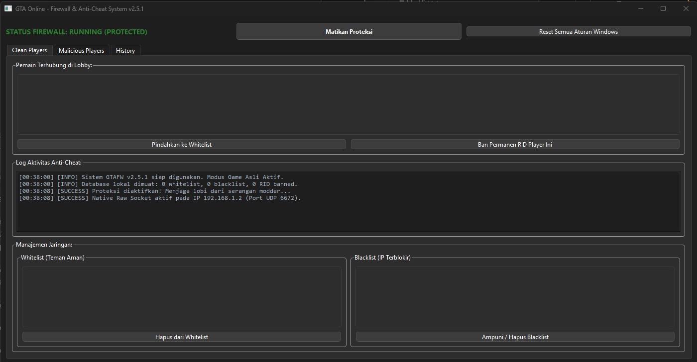
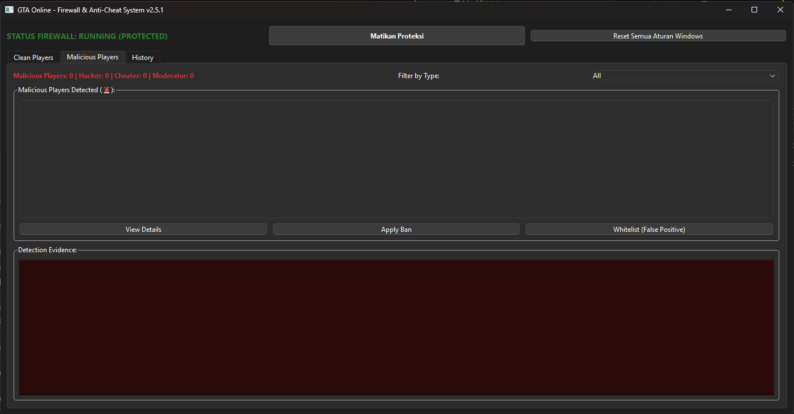
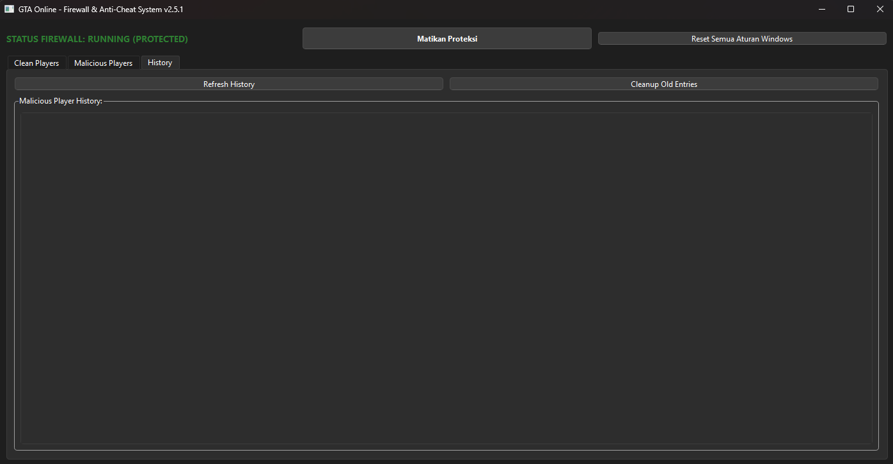

# GTA Firewall (GTAFW) v2.5.1


**GTAFW (GTA Firewall)** adalah aplikasi keamanan jaringan lokal berbasis **PyQt6** dan **Native Raw Sockets**. Aplikasi ini memproteksi sesi lobi GTA Online dari *modder*, serangan *crash packet*, dan *lobby flooding* melalui ekstraksi **Rockstar ID (RID)** serta **device fingerprint (`FP`)** secara real-time pada protokol P2P UDP port **6672**.

Mode default adalah **MONITOR ONLY**: ancaman dilaporan, tetapi blokir heuristik otomatis dimatikan sampai checkbox **Auto-Ban** diaktifkan. Ban RID/blacklist yang Anda setel manual tetap berlaku.

---

## Tampilan Sistem & Review Operasional





### Review Performa & Pengujian Sesi Publik

Berdasarkan pengujian pada lobi publik GTA Online (*Public Session*):

* **Stabilitas lobi**: pemantauan P2P tanpa memicu disconnect massal (*lobby split*).
* **Device fingerprinting (`FP`)**: setiap peer mendapat hash 8 karakter dari IP + TTL (contoh: `FP: 041A7CD4`).
* **Bypass IP lokal**: host, loopback, multicast, dan alamat privat RFC1918 dikecualikan agar tidak *self-block*.
* **Sniffing ringan**: raw socket bawaan Python, tanpa Scapy/Npcap.

---

## Fitur Utama

### 1. Panel kontrol & Windows Firewall

* **Native Raw Socket Sniffer**: tombol **Aktifkan Proteksi** membuka raw socket Windows dan menganalisis UDP port 6672.
* **Status real-time**: hijau `STATUS FIREWALL: RUNNING (PROTECTED)` atau merah `PROTECTION DISABLED`.
* **Emergency flush**: **Reset Semua Aturan Windows** menghapus aturan `GTAFW_Block_*` (masuk dan keluar) via `netsh`.
* **Auto-Ban (opsional, default OFF)**: jika ON, IP dengan *confidence* **≥ 0.85** serta heuristik crash/flood (RID terkonfirmasi) diblokir otomatis.

### 2. Tab Clean Players

* Daftar pemain di lobi: IP, RID, FP, dan ukuran payload.
* Log aktivitas anti-cheat.
* Whitelist teman dan blacklist/ban permanen RID secara manual.

### 3. Tab Malicious Players

Klasifikasi: Hacker, Cheater, Moderator, Exploiter, MultiAuth, Bot, Script Kiddie.

Indikator mesin skor:

* Ukuran paket **> 1600 byte** (crash packet), butuh **3 paket besar beruntun** sebelum aksi heuristik.
* Pelanggaran PPS di atas **500 paket/detik**, dihitung per jendela 1 detik (bukan per paket).
* Anomali jaringan (TTL ekstrem) dan RID mismatch (satu IP, banyak RID).

Ambang auto-ban klasifikasi: *confidence* **≥ 0.85** dan checkbox Auto-Ban aktif.

### 4. Tab History

* Persistensi JSON di `malicious_players.json`.
* `session_count` dan `last_seen`.
* **Cleanup Old Entries** menghapus entri lebih dari 7 hari.

### 5. Fingerprint host (anti false-positive)

Kombinasi IP + TTL di-hash SHA-256 (8 karakter) agar spoof IP tidak meniru fingerprint pemain lain.

---

## Struktur Proyek

```text
gtafw/
├── .gtafw/                     # Virtual environment Python
├── src/
│   ├── __init__.py
│   ├── core.py                 # Raw socket sniffer & fingerprint
│   ├── firewall.py             # Windows Firewall (netsh)
│   ├── gui.py                  # UI PyQt6 & signal router
│   └── malicious_player.py     # Klasifikasi, tracker, database JSON
├── gtafw.png
├── main.py                     # Entry point & cek Administrator
├── README.md
└── requirements.txt            # PyQt6
```

---

## ⚙️ Panduan Instalasi & Menjalankan

Aplikasi membutuhkan akses mentah ke Kartu Jaringan (*Network Interface*) dan Windows Firewall melalui skrip `netsh` (wajib **Run as Administrator**).

### Cara Menjalankan (Opsi Cepat `.exe` - Rekomendasi)
Untuk pengguna umum, Anda tidak perlu menginstal Python:
1. Unduh file **`gtafw.exe`** versi terbaru secara gratis melalui halaman [👉 GitHub Releases](https://github.com).
2. Setelah selesai diunduh, pastikan hak akses Administrator terpenuhi dengan cara **Klik Kanan -> Run as Administrator**.


### Cara Menjalankan (Opsi Cepat `.exe`)
Untuk pengguna umum, Anda bisa menggunakan file executable di folder `dist/` setelah memastikan hak akses Administrator terpenuhi.

### Instalasi Source Code (Developer)
1. Kloning repositori:
```powershell
git clone https://github.com/duhemen/gtafw.git
cd gtafw
```
2. Buat dan aktifkan virtual environment di PowerShell/Command Prompt (Administrator):
```powershell
python -m venv .gtafw
.\.gtafw\Scripts\activate
```
3. Instal dependensi:
```powershell
python -m pip install --upgrade pip
pip install -r requirements.txt
python main.py
```

---

## 📖 Panduan Penggunaan & Confidence Score

1. **Proteksi & Whitelist:** Aktifkan proteksi saat sesi GTA Online (UDP 6672) dan pindahkan teman ke whitelist.
2. **Manajemen Ban:** Lakukan ban manual (pastikan RID bukan `UNKNOWN_RID`) atau gunakan auto-ban jika diaktifkan. Gunakan reset aturan Windows jika diperlukan.
3. **Confidence Score (0.00 - 1.00):**
   * **0.15 - 0.45 (Rendah):** Kemungkinan masalah jaringan/P2P (*False Positive*). **Biarkan saja.**
   * **0.50 - 0.75 (Sedang):** Indikasi mencurigakan. **Pantau permainan.**
   * **0.80 - 1.00 (Tinggi):** Valid serangan atau *packet flood*. **Sangat direkomendasikan untuk diblokir.**

---
🎛️ **Catatan Bijak untuk Pengguna:**  
Fitur *Auto-Ban* sengaja dinonaktifkan secara bawaan agar Anda memiliki kendali penuh. Gunakan alat ini sebagai sistem peringatan dini, bukan alat untuk memblokir semua orang yang memiliki koneksi internet lambat!
