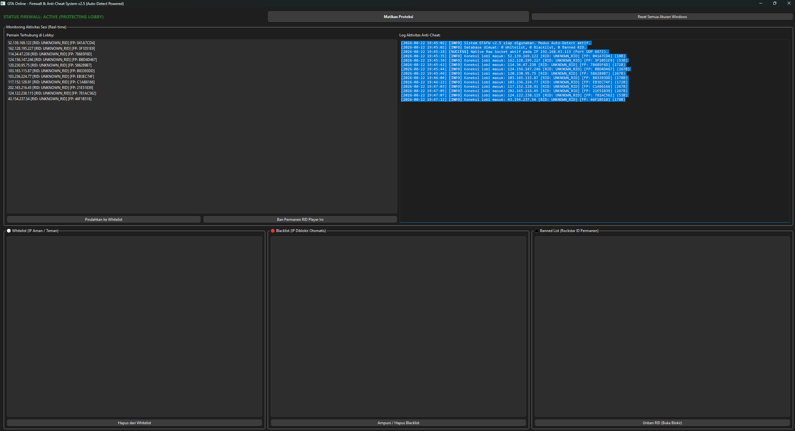

# 🛡️ GTA Firewall (GTAFW) v2.5


**GTAFW (GTA Firewall)** adalah aplikasi keamanan jaringan lokal tingkat lanjut berbasis **PyQt6** dan **Native Raw Sockets**. Aplikasi ini dirancang khusus untuk memproteksi sesi lobi GTA Online dari *Modder*, serangan *Crash Packet*, dan *Lobby Flooding* melalui ekstraksi **Rockstar ID (RID)** serta **Device Fingerprinting (`FP`)** secara real-time pada protokol P2P UDP port 6672.

---

## 🖼️ Tampilan Sistem & Review Operasional



### 📊 Review Performa & Pengujian Sesi Publik

Berdasarkan hasil pengujian langsung pada lobi publik GTA Online (*Public Session*):

* **Stabilitas Lobi (Zero Session Split)**: Aplikasi berhasil memantau lalu lintas P2P tanpa memicu *disconnect* massal (*lobby split*). Pemain resmi tetap terhubung secara stabil.
* **Presisi Device Fingerprinting (`FP`)**: Setiap klien *peer* yang terhubung mendapatkan Hash Fingerprint unik (contoh: `FP: 041A7CD4`, `FP: 3F1051E9`). Hal ini mencegah kesalahan pemblokiran acak (*false positive*) yang kerap terjadi pada metode pemblokiran IP Range.
* **Bypass IP Lokal Keras**: Sistem secara otomatis mengecualikan IP host lokal (`192.168.43.113`) dan IP *loopback/broadcast*, sehingga aplikasi aman dari risiko *self-block*.
* **Lightweight Sniffing Engine**: Penggunaan Raw Socket bawaan Python menghilangkan ketergantungan pada pustaka pihak ketiga seperti Scapy atau Npcap driver, sehingga konsumsi CPU dan RAM tetap minim saat game berjalan.

---

## 🚀 Fitur Utama

---
## 1. Panel Kontrol Utama & Integrasi Windows Firewall
Berada di bagian paling atas aplikasi, panel ini bertindak sebagai sakelar utama sistem keamanan:

* Native Raw Socket Sniffer: Ketika tombol "Aktifkan Proteksi" ditekan, aplikasi membuka soket mentah (raw socket) langsung di Windows untuk mencegat dan menganalisis lalu lintas jaringan UDP pada port permainan GTA Online (Default: Port 6672).
* Real-time Status Indicator: Menampilkan status aktif hijau (STATUS FIREWALL: RUNNING (PROTECTED)) atau merah saat tidak aktif (PROTECTION DISABLED).
* Emergency Firewall Flush: Tombol "Reset Semua Aturan Windows" berfungsi membersihkan seluruh aturan pemblokiran IP masuk dan keluar buatan aplikasi secara bersih dari Windows Advanced Firewall menggunakan skrip netsh, memulihkan jaringan Anda secara instan jika terjadi salah blokir.

## 2. Tab "Clean Players" (Pemantauan Lobi Tradisional)
Tab pertama ini mempertahankan fungsionalitas dasar pemantauan jaringan lobi secara interaktif:

* Lobby Discovery List: Menampilkan daftar pemain bersih yang terhubung di dalam lobi permainan secara langsung (Alamat IP, Rockstar ID/RID, dan ID Fingerprint unik mereka) beserta ukuran data yang mereka kirim.
* Anti-Cheat Activity Logs: Konsol hitam interaktif berbasis teks untuk mencatat log aktivitas (misalnya: penangkapan socket, status pemblokiran jaringan, informasi penemuan IP).
* Manual Management (Whitelist & Blacklist):
* Anda bisa memindahkan teman ke kolom Whitelist agar mereka tidak terpengaruh oleh sistem pemblokiran otomatis.
   * Anda bisa melakukan Ban Permanen RID atau memasukkan IP pengganggu ke daftar Blacklist untuk diblokir secara manual melalui Windows Firewall.

## 3. Tab "Malicious Players" (Sistem Deteksi Modder Otomatis — Fitur Baru)
Ini adalah modul kecerdasan buatan utama yang membedakan versi v2.5 dari versi-versi sebelumnya:

* Triage Statistik Modder: Menghitung jumlah ancaman secara real-time yang dikelompokkan ke dalam kategori khusus: Hacker, Cheater, Moderator, Exploiter, MultiAuth, Bot, dan Script Kiddie.
* Classification Engine (Mesin Pengukur Skor Kepercayaan): Menganalisis paket data masuk berdasarkan indikator bobot ancaman:
* Ukuran Paket (>1400 Bytes): Terdeteksi sebagai serangan Crash Packet.
   * Pelanggaran PPS (Packet Per Second): Mengukur batas banjir paket (Flooding) saat modder mengirim data abnormal di atas 280 PPS.
   * Anomali Jaringan & Perilaku: Mendeteksi pemalsuan IP (IP Spoofing) atau pembajakan RID.
* Auto-Ban High Confidence Threats: Jika pemain mengumpulkan Confidence Score keamanan $\ge 0.8$, GTAFW akan melabeli mereka sebagai ancaman kritis, memancarkan sinyal peringatan merah, dan otomatis memblokir IP modder tersebut menggunakan firewall tanpa perlu intervensi manual dari Anda.
* Detection Evidence Viewer: Kolom bawah berwarna merah marun berfungsi menampilkan berkas bukti forensik secara rinci mengapa pemain tersebut diklasifikasikan sebagai modder (menyertakan stempel waktu kejadian, tingkat keparahan ancaman, dan deskripsi aktivitas ilegalnya).

## 4. Tab "History" (Persistent Log Database)
Berfungsi sebagai basis data jangka panjang agar sistem proteksi tetap berjalan meskipun aplikasi atau komputer Anda dinyalakan ulang:

* Database Persisten JSON: Semua data modder yang pernah terdeteksi disimpan rapi ke berkas lokal malicious_players.json.
* Riwayat Kunjungan Sesi (Session Tracker): Mencatat seberapa sering modder tersebut berpapasan dengan Anda di lobi GTA Online (session_count) dan kapan terakhir kali mereka terlihat (last_seen).
* Memory & Storage Optimizer: Menyediakan fungsi "Cleanup Old Entries" untuk menghapus log modder yang sudah usang (misalnya data yang sudah lebih dari 7 hari atau 30 hari) agar basis data tetap ringan dan tidak membebani memori RAM komputer Anda.

## 5. Mekanisme Keamanan Jaringan "Host Fingerprint" (Anti-False Positive)

* Kombinasi IP + TTL (Time to Live): Modder sering kali menggunakan VPN atau fitur IP Spoofing untuk meniru alamat IP pemain bersih di lobi. GTAFW memitigasi hal ini dengan mengombinasikan IP dan nilai TTL paket data dengan enkripsi hash SHA-256 untuk menghasilkan 8 karakter Fingerprint Unik.
* Fungsi ini memastikan sistem tidak akan melakukan pemblokiran massal yang salah sasaran (false positive) kepada pemain bersih yang kebetulan memiliki IP serupa akibat manipulasi modder.

---

## 📁 Struktur Proyek

```text
gtafw/
├── .gtafw/                # Environment virtual Python
├── src/
│   ├── __init__.py        # Module package initializer
│   ├── core.py            # Engine sniffing Native Raw Socket & Fingerprinting
│   ├── firewall.py        # Modul manipulasi Windows Firewall (netsh API)
│   └── gui.py             # User Interface PyQt6 & Signal Router
├── gtafw.png              # Tangkapan layar antarmuka & review sistem
├── main.py                # Entry point & privilege checker (Admin Escalation)
├── README.md              # Dokumentasi teknis proyek
└── requirements.txt       # Daftar dependensi Python (PyQt6)

```

---

## ⚙️ Panduan Instalasi

Sistem ini wajib dioperasikan pada OS Windows dengan hak akses Administrator.

### 1. Kloning Repositori & Masuk ke Direktori

```powershell
git clone [https://github.com/duhemen/gtafw.git](https://github.com/duhemen/gtafw.git)
cd gtafw

```

### 2. Membuat & Mengaktifkan Virtual Environment

Buka **PowerShell / Command Prompt** (Run as Administrator):

```powershell
python -m venv .gtafw
.\gtafw\Scripts\activate

```

### 3. Menginstal Dependensi

```powershell
pip install --upgrade pip
pip install -r requirements.txt

---

## 🎮 Cara Menjalankan Aplikasi

Aplikasi membutuhkan akses mentah ke Kartu Jaringan (*Network Interface Card*) dan Windows Firewall. **Wajib dijalankan sebagai Administrator**.

```powershell
# Pastikan venv .gtafw aktif
python main.py

---

## 📖 Panduan Penggunaan

1. **Aktifkan Proteksi**:
Jalankan aplikasi lalu klik **Aktifkan Proteksi** saat berada di sesi GTA Online. Sistem akan mulai menangkap lalu lintas P2P di port UDP 6672.
2. **Pantau Klien & Fingerprint**:
Daftar pemain yang terhubung akan menampilkan IP, Rockstar ID (`RID`), dan Device Fingerprint (`FP`).
3. **Whitelist Teman**:
Pilih IP teman di daftar lobi aktif, lalu klik **Pindahkan ke Whitelist** untuk menjamin koneksinya tidak terganggu.
4. **Permanent Ban RID & Fingerprint**:
Pilih modder/pengganggu pada tabel aktif, lalu klik **Ban Permanen RID Player Ini**. Identitas RID dan Fingerprint perangkat akan dikunci permanen.
5. **Reset Emergency**:
Gunakan tombol **Reset Semua Aturan Windows** untuk membersihkan seluruh aturan pemblokiran firewall buatan GTAFW secara instan.
